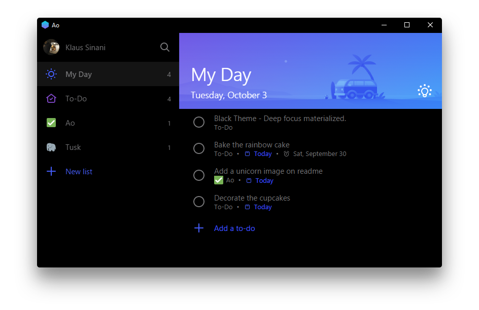
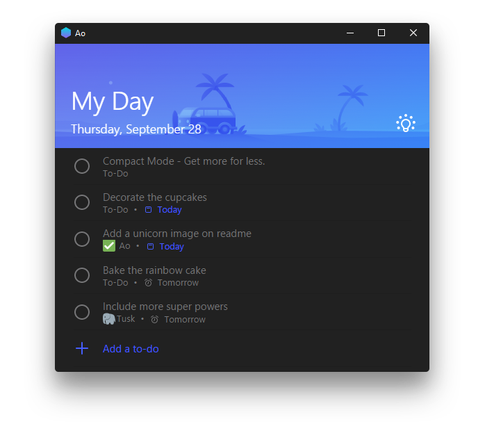
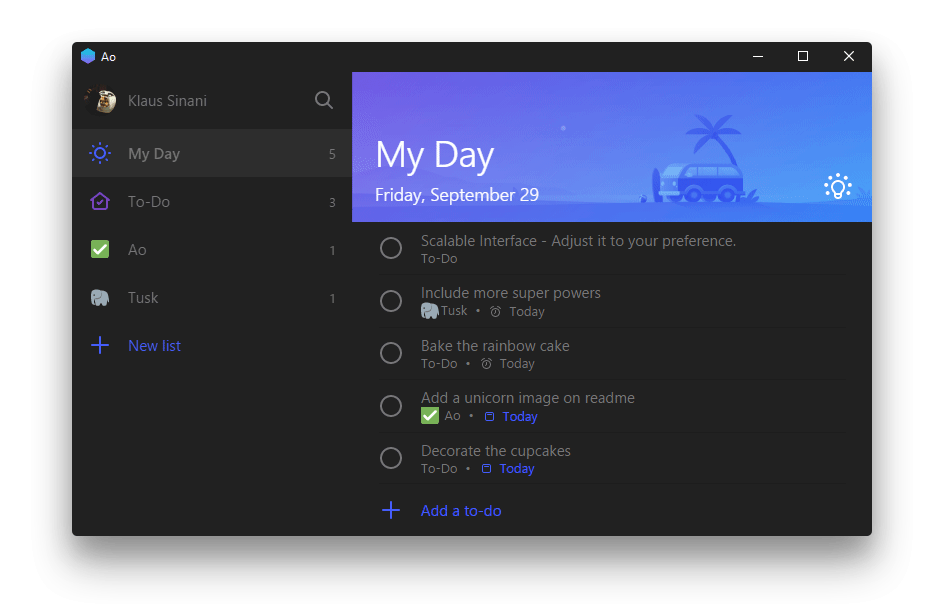

<h1 align="center">
   Ao
</h1>

<h4 align="center">
  ✔️ Elegante Microsoft To-Do Desktop App
</h4>

  

  
  

## Beschreibung

Ao ist eine inoffizielle, funktionsreiche, Open Source, community-getriebene, kostenfreie Microsoft To-Do App und wird bereits in mehr als [120 Ländern](https://snapcraft.io/ao) genutzt.

Bei [Gitter](https://gitter.im/klaussinani/ao) oder [Twitter](https://twitter.com/klaussinani) kannst du dich mit uns in Verbindung setzen.

Schau in den [Leitlinien](https://github.com/klaussinani/ao/blob/master/contributing.md#translating-documentation) vorbei und lerne mehr darüber, wie du dieses Dokument in weitere Sprachen übersetzen kannst.

Weitere Desktop Apps findest du [hier](#related-apps).

## Highlights

- Themen in [Dark](#black-theme), [Light](#dark-theme), [Sepia](#sepia-theme) & [Vibrant](#vibrant-themes)
- [Kompaktmodus](#compact-mode) & ["Auto-Night Modus"](#auto-night-mode)
- [Lokale](#local-shortcut-keys) & [globale](#global-shortcut-keys) Tastatur Shortcuts
- [Eigene Shortcurts](#custom-shortcut-keys)
- [Listennavigation](#list-navigation)
- [Skalierbare Oberfläche](#scalable-interface)
- Automatische Updates ✔️
- Unterstützung von mehreren Plattformen
- Tiefe Einbettung ins Betriebssystem

✔️ derzeit nur unter Windows & Linux

## Übersicht

- [Beschreibung](#description)
- [Highlights](#highlights)
- [Installation](#install)
- [Funktionen](#features)
- [Tastatur Shortcuts](#keyboard-Shortcuts)
- [Entwicklung](#development)
- [Ähnliche Apps](#related-apps)
- [Team](#team)
- [Disclaimer](#disclaimer)
- [Lizenz](#license)

## Installation

#### Github Releases

Auf der [Github Releases](https://github.com/klaussinani/ao/releases/latest) Seite findest du Installationsdateien für dein Betriebssystem.

#### Homebrew

Mit macOS und [`Homebrew Cask`](https://caskroom.github.io/) kannst du dir Ao über das Terminal installieren: `brew install --cask ao`

#### Snap

Unter Ubuntu Linux kannst du mit [`Snap`](https://snapcraft.io/ao) die App installieren: `snap install ao`

#### AUR

Unter Arch Linux kannst du mit [`AUR`](https://aur.archlinux.org/packages/ao/) die App installieren: `yaourt ao`

#### Hinweis

Die Version unter `AUR` kann unter umständen nicht die aktuellste Version sein. Nutze dann bitte den direkten Download von der [Github Releases](https://github.com/klaussinani/ao/releases/latest) Seite.

## Funktionen

### Vibrant Theme

Drücke <kbd>Cmd</kbd> <kbd>Alt</kbd> <kbd>U</kbd> / <kbd>Cmd</kbd> <kbd>Alt</kbd> <kbd>J</kbd> um das [Dark](https://cdn.rawgit.com/klaussinani/ao/55af062e/../media/vibrant-dark-theme.png) oder das [Light](https://cdn.rawgit.com/klaussinani/ao/55af062e/../media/vibrant-theme.png) Vibrant Theme zu aktivieren.

Bitte beachte, dass das Theme **nur unter macOS** verfügbar ist.

      

### Sepia Theme

Perfekt für spiegelnde Bildschirme. Aktiviere das Sepia Theme per  <kbd>Cmd/Ctrl</kbd> <kbd>G</kbd>

      

### Black Theme

Steigere deine Produktivität und aktiviere das Theme mit mit <kbd>Cmd/Ctrl</kbd> <kbd>W</kbd>

      

### Dark Theme

Dunkel, aber nicht zu dunkel. Mache es zu deinem Theme <kbd>Cmd/Ctrl</kbd> <kbd>H</kbd>

      

### Kompakter Modus

Du hast wenig Platz? Skaliere einfach das Fenster und die App passt sich automatisch an.

      

### Listennavigation

Navigiere mit wenig Aufwand durch deine Listen. Drücke einfach <kbd>Cmd/Ctrl</kbd> <kbd>Tab</kbd> / <kbd>Cmd/Ctrl</kbd> <kbd>Shift</kbd> <kbd>Tab</kbd> oder springe einfach direkt zu deiner gewünschten Liste mit <kbd>Cmd/Ctrl</kbd> <kbd>1</kbd> - <kbd>9</kbd>

      

### Eigene Shortcuts

Navigiere zur Datei `~/.ao.json` oder drücke <kbd>Cmd/Ctrl</kbd> <kbd>.</kbd> und passe die Shortcuts an deine eigenen Bedürfnisse an. Um die Shortscuts zurückzusetzen lösche einfach die Ao Konfigurationsdatei aus deinem "Home-Verzeichnis".

      

### Skalierbare Oberfläche

Passe den Zoom Faktor einfach durch <kbd>Cmd/Ctrl</kbd> <kbd>Shift</kbd> <kbd>=</kbd> oder <kbd>Cmd/Ctrl</kbd> <kbd>-</kbd> an.

      

### "Auto-Night" Modus

Mit dem "Auto-Night" Modus passt sich Ao farblich automatisch an die zur aktuellen Uhrzeit herrschenden Lichtverhältnisse an. Drücke dazu einfach <kbd>Cmd/Ctrl</kbd> <kbd>Alt</kbd> <kbd>N</kbd>

## Tastatur Shortcuts

### Lokale Shortcuts

40+ lokale Tastatur Shortcuts für noch produktiveres Arbeiten.

Schau dir alle verfügbaren lokalen Tastatur Shortcuts an.

 

Beschreibung               | Tasten
-------------------------- | --------------------------
Menü                       | <kbd>Alt</kbd>
Vollbild beenden           | <kbd>F11</kbd>
zurück zu den Todos        | <kbd>Esc</kbd>
Todo erstellen             | <kbd>Cmd/Ctrl</kbd> <kbd>N</kbd>
Todo löschen               | <kbd>Cmd/Ctrl</kbd> <kbd>D</kbd>
Todo umbenennen            | <kbd>Cmd/Ctrl</kbd> <kbd>T</kbd>
Todo Suche                 | <kbd>Cmd/Ctrl</kbd> <kbd>F</kbd>
Todo zu "Mein Tag"         | <kbd>Cmd/Ctrl</kbd> <kbd>K</kbd>
Neue Liste                 | <kbd>Cmd/Ctrl</kbd> <kbd>L</kbd>
Liste umbenennen           | <kbd>Cmd/Ctrl</kbd> <kbd>Y</kbd>
Sidebar umschalten         | <kbd>Cmd/Ctrl</kbd> <kbd>O</kbd>
"Mein Tag" umschalten      | <kbd>Cmd/Ctrl</kbd> <kbd>M</kbd>
Cortana umschalten         | <kbd>Cmd/Ctrl</kbd> <kbd>E</kbd>
Dark Theme                 | <kbd>Cmd/Ctrl</kbd> <kbd>H</kbd>
Sepia Theme                | <kbd>Cmd/Ctrl</kbd> <kbd>G</kbd>
Black Theme                | <kbd>Cmd/Ctrl</kbd> <kbd>B</kbd>
Einstellungen              | <kbd>Cmd/Ctrl</kbd> <kbd>,</kbd>
Text verkleinern           | <kbd>Cmd/Ctrl</kbd> <kbd>-</kbd>
Shortcut bearbeiten        | <kbd>Cmd/Ctrl</kbd> <kbd>.</kbd>
Zoom Level zurücksetzen    | <kbd>Cmd/Ctrl</kbd> <kbd>0</kbd>
nächste Liste anzeigen     | <kbd>Cmd/Ctrl</kbd> <kbd>Tab</kbd>
zur Liste springen         | <kbd>Cmd/Ctrl</kbd> <kbd>1</kbd> - <kbd>9</kbd>
Logout                     | <kbd>Cmd/Ctrl</kbd> <kbd>Alt</kbd> <kbd>Q</kbd>
Vibrant Light Theme        | <kbd>Cmd/Ctrl</kbd> <kbd>Alt</kbd> <kbd>U</kbd>
Vibrant Dark Theme         | <kbd>Cmd/Ctrl</kbd> <kbd>Alt</kbd> <kbd>J</kbd>
"Auto-Night" Modus         | <kbd>Cmd/Ctrl</kbd> <kbd>Alt</kbd> <kbd>N</kbd>
Liste löschen              | <kbd>Cmd/Ctrl</kbd> <kbd>Shift</kbd> <kbd>D</kbd>
Add Due Date               | <kbd>Cmd/Ctrl</kbd> <kbd>Shift</kbd> <kbd>T</kbd>
Ao neu laden               | <kbd>Cmd/Ctrl</kbd> <kbd>Shift</kbd> <kbd>R</kbd>
Erinnerung erstellen       | <kbd>Cmd/Ctrl</kbd> <kbd>Shift</kbd> <kbd>E</kbd>
Todo abhaken               | <kbd>Cmd/Ctrl</kbd> <kbd>Shift</kbd> <kbd>N</kbd>
beendete Todos ausblenden  | <kbd>Cmd/Ctrl</kbd> <kbd>Shift</kbd> <kbd>H</kbd>
Entwicklertools            | <kbd>Cmd/Ctrl</kbd> <kbd>Shift</kbd> <kbd>I</kbd>
Set Always on Top          | <kbd>Cmd/Ctrl</kbd> <kbd>Shift</kbd> <kbd>P</kbd>
Text vergrößern            | <kbd>Cmd/Ctrl</kbd> <kbd>Shift</kbd> <kbd>=</kbd>

 

### Globale Shortcuts

Greife in jeder Situation auf Ao zu. Die globalen Shortcuts kannst du an deine eigenen Bedürfnisse in der `~/.ao.json` Datei anpassen.

Schau dir alle verfügbaren globalen Tastatur Shortcuts an.

 

Beschreibung               | Globaler Shortcut
-------------------------- | --------------------------
Verstecke das Ao Fenster   | <kbd>Alt</kbd> <kbd>Shift</kbd> <kbd>A</kbd>
Neuer To-Do Eintrag        | <kbd>Alt</kbd> <kbd>Shift</kbd> <kbd>C</kbd>
Suche                      | <kbd>Alt</kbd> <kbd>Shift</kbd> <kbd>F</kbd>

 

## Entwicklung

Weitere Informationen, wie du zum Projekt beitragen kannst, findest du in den [Richtlinien](https://github.com/klaussinani/ao/blob/master/contributing.md).

- Fork the repository and clone it to your machine
- Navigate to your local fork `cd ao`
- Install the project dependencies `npm install` or `yarn install`
- Run Ao on dev mode `npm start` or `yarn start`
- Lint code for errors `npm test` or `yarn test`
- Build binaries and installers `npm run dist` or `yarn dist`

## Ähnliche Apps

- [Tusk](https://github.com/champloohq/tusk) - verbesserte Evernote Desktop App.
- [Taskbook](https://github.com/klaussinani/taskbook) - Aufgaben, "boards" und Notizen für die Kommandozeile.

## Team

Entwickelt mit ❤ durch

- Klaus Sinani [(@klaussinani)](https://github.com/klaussinani)
- Mario Sinani [(@mariocfhq)](https://github.com/mariocfhq)
- Thanasis Gkanos [(@ThanasisGkanos)](https://github.com/ThanasisGkanos)

## Disclaimer

Ao ist eine inoffizielle, Open Source, third-party, community-driven, kostenfreie App und steht in keiner Verbindung zu Microsoft.

## Lizenz

[MIT](https://github.com/klaussinani/ao/blob/master/license.md)
