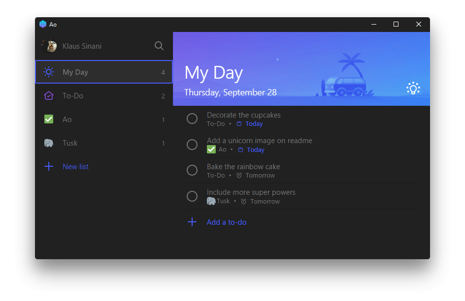

<h1 align="center">
  <br/>Ao
</h1>

<h4 align="center">
  Elegant Microsoft To-Do desktop app
</h4>

<div align="center">
  <a href="https://github.com/klaussinani/ao">
    
  </a>
</div>

<p align="center">
  <a href="https://travis-ci.org/klaussinani/ao">
    
  </a>
</p>

<div align="center">
  <br>
  <sup><b>Sponsored by:</b></sup>
  <br>
  <a href="https://betterstack.com">
    <div>
      
    </div>
    <sup>
      Spot, Resolve, and Prevent Downtime.
    </sup>
  </a>
</div>

## Description

Ao is an unofficial, featureful, open source, community-driven, free Microsoft To-Do app, used by people in more than [120 countries](https://snapcraft.io/ao).

Read this document in: [Deutsch](https://github.com/klaussinani/ao/blob/master/docs/i18n/readme.GER.md).

You can now support the development process through [GitHub Sponsors](https://github.com/sponsors/klaussinani).

Visit the [contributing guidelines](https://github.com/klaussinani/ao/blob/master/contributing.md#translating-documentation) to learn more on how to translate this document into more languages.

Come over to [Gitter](https://gitter.im/klaussinani/ao) or [Twitter](https://twitter.com/klaussinani) to share your thoughts on the project.

You can find more apps [here](#related-apps).

## Highlights

- Black, Dark & Sepia Themes
- Compact & Auto-Night Modes
- Local & Global Customizable Keyboard Shortcuts
- List Navigation
- Scalable Interface
- Update Notifications
- Cross Platform

## Contents

- [Description](#description)
- [Highlights](#highlights)
- [Install](#install)
- [Features](#features)
- [Keyboard Shortcuts](#keyboard-shortcuts)
- [Development](#development)
- [Related Apps](#related-apps)
- [Team](#team)
- [Sponsors](#sponsors)
- [Disclaimer](#disclaimer)
- [License](#license)

## Install

#### Github Releases

Head to the [releases](https://github.com/klaussinani/ao/releases/latest) page and download the appropriate installer for your system.

#### Snapcraft

Ubuntu Linux users can directly install through [`Snapcraft`](https://snapcraft.io/ao) `snap install ao`

#### Homebrew

Macos users can directly install through [`Homebrew Cask`](https://caskroom.github.io/) `brew cask install ao`

#### Note

The version available on `Homebrew Cask` may not be the latest, since unlike `Snapcraft`, it is not offically maintained. If that is the case, please consider downloading directly from the [Github releases](https://github.com/klaussinani/ao/releases/latest) page.

## Features

Visit the project [homepage](https://klaussinani.github.io/ao) to view all features in detail.

- Auto Night Mode - Press <kbd>Cmd/Ctrl</kbd> <kbd>Alt</kbd> <kbd>N</kbd> to allow Tusk to adjust to your environment.
- Black Theme - Activate it by pressing <kbd>Cmd/Ctrl</kbd> <kbd>B</kbd>
- Compact Mode - Downsize the window to enter the mode.
- Custom Shortcut Keys - Navigate to `~/.ao.json` or press <kbd>Cmd/Ctrl</kbd> <kbd>.</kbd> to modify any shortcut key. To reset delete `~/.ao.json` & restart the app.
- Dark Theme -Activate it by pressing <kbd>Cmd/Ctrl</kbd> <kbd>H</kbd>
- Global Shortcut Keys - Enable them by using the `File` > `Enable Global Shortcut Keys` option.
- List Navigation - Navigate your lists by pressing  <kbd>Cmd/Ctrl</kbd> <kbd>Tab</kbd> / <kbd>Cmd/Ctrl</kbd> <kbd>Shift</kbd> <kbd>Tab</kbd> or jump directly to one by using <kbd>Cmd/Ctrl</kbd> <kbd>1</kbd> - <kbd>9</kbd>
- Scalable Interface - Adjust the zooming factor by pressing <kbd>Cmd/Ctrl</kbd> <kbd>Shift</kbd> <kbd>=</kbd> or <kbd>Cmd/Ctrl</kbd> <kbd>-</kbd>.
- Sepia Theme - Activate it by pressing <kbd>Cmd/Ctrl</kbd> <kbd>G</kbd>.
- Update Notifications - Customize the app's update checking frequency.

## Keyboard Shortcuts

### Local Shortcut Keys

40+ local keyboard shortcuts. Toggle anything in a flash.

<details>
<summary>View all the available local keyboard shortcuts.</summary>

<br/>

Description                | Keys
-------------------------- | --------------------------
Activate Auto Night Mode   | <kbd>Cmd/Ctrl</kbd> <kbd>Alt</kbd> <kbd>N</kbd>
Add Due Date               | <kbd>Cmd/Ctrl</kbd> <kbd>Shift</kbd> <kbd>T</kbd>
Add Todo to My Day         | <kbd>Cmd/Ctrl</kbd> <kbd>K</kbd>
Complete Todo              | <kbd>Cmd/Ctrl</kbd> <kbd>Shift</kbd> <kbd>N</kbd>
Delete List                | <kbd>Cmd/Ctrl</kbd> <kbd>Shift</kbd> <kbd>D</kbd>
Delete Todo                | <kbd>Cmd/Ctrl</kbd> <kbd>D</kbd>
Edit Shortcut Keys         | <kbd>Cmd/Ctrl</kbd> <kbd>.</kbd>
Hide Completed Todos       | <kbd>Cmd/Ctrl</kbd> <kbd>Shift</kbd> <kbd>H</kbd>
Jump to List               | <kbd>Cmd/Ctrl</kbd> <kbd>1</kbd> - <kbd>9</kbd>
Make Text Larger           | <kbd>Cmd/Ctrl</kbd> <kbd>Shift</kbd> <kbd>=</kbd>
Make Text Smaller          | <kbd>Cmd/Ctrl</kbd> <kbd>-</kbd>
Navigate to Next List      | <kbd>Cmd/Ctrl</kbd> <kbd>Tab</kbd>
New List                   | <kbd>Cmd/Ctrl</kbd> <kbd>L</kbd>
New Todo                   | <kbd>Cmd/Ctrl</kbd> <kbd>N</kbd>
Rename List                | <kbd>Cmd/Ctrl</kbd> <kbd>Y</kbd>
Rename Todo                | <kbd>Cmd/Ctrl</kbd> <kbd>T</kbd>
Reset Zoom Level           | <kbd>Cmd/Ctrl</kbd> <kbd>0</kbd>
Return to Todos            | <kbd>Esc</kbd>
Search Todos               | <kbd>Cmd/Ctrl</kbd> <kbd>F</kbd>
Set Always on Top          | <kbd>Cmd/Ctrl</kbd> <kbd>Shift</kbd> <kbd>P</kbd>
Set Reminder               | <kbd>Cmd/Ctrl</kbd> <kbd>Shift</kbd> <kbd>E</kbd>
Sign out                   | <kbd>Cmd/Ctrl</kbd> <kbd>Alt</kbd> <kbd>Q</kbd>
Toggle Black Theme         | <kbd>Cmd/Ctrl</kbd> <kbd>B</kbd>
Toggle Dark Theme          | <kbd>Cmd/Ctrl</kbd> <kbd>H</kbd>
Toggle Important           | <kbd>Cmd/Ctrl</kbd> <kbd>I</kbd>
Toggle My Day              | <kbd>Cmd/Ctrl</kbd> <kbd>M</kbd>
Toggle Planned             | <kbd>Cmd/Ctrl</kbd> <kbd>P</kbd>
Toggle Sepia Theme         | <kbd>Cmd/Ctrl</kbd> <kbd>G</kbd>
Toggle Settings            | <kbd>Cmd/Ctrl</kbd> <kbd>,</kbd>
Toggle Sidebar             | <kbd>Cmd/Ctrl</kbd> <kbd>O</kbd>
Toggle Tasks               | <kbd>Cmd/Ctrl</kbd> <kbd>J</kbd>
Toggle Window Menu         | <kbd>Alt</kbd>

<br/>

</details>

### Global Shortcut Keys

Access Ao at any moment from anywhere within your operating system. All global shortcuts can be customized to match your own preference through the configuration file `~/.ao.json`.

<details>
<summary>View all the available global keyboard shortcuts.</summary>

<br>

Description                | Global Shortcut
-------------------------- | --------------------------
Create New Todo            | <kbd>Cmd/Ctrl</kbd> <kbd>Alt</kbd> <kbd>C</kbd>
Search Todos               | <kbd>Cmd/Ctrl</kbd> <kbd>Alt</kbd> <kbd>F</kbd>
Toggle Ao Window           | <kbd>Cmd/Ctrl</kbd> <kbd>Alt</kbd> <kbd>A</kbd>

<br/>

</details>

## Proxy
Ao uses Electron, if you need to use proxy behind proxy, add arguments to the end of executable.
```
# Disable proxy
--no-proxy-server

# Manual proxy address
--proxy-server=<scheme>=<uri>[:<port>][;...] | <uri>[:<port>] | "direct://"

# Manual PAC address
--proxy-pac-url=<pac-file-url>

# Disable proxy per host
--proxy-bypass-list=(<trailing_domain>|<ip-address>)[:<port>][;...]
```
For advance users, please access [Electron Chrome Command Line Switches](https://github.com/electron/electron/blob/master/docs/api/chrome-command-line-switches.md).

## Development

For more info on how to contribute to the project, please read the [contributing guidelines](https://github.com/klaussinani/ao/blob/master/contributing.md).

- Fork the repository and clone it to your machine
- Navigate to your local fork `cd ao`
- Install the project dependencies `npm install` or `yarn install`
- Run Ao on dev mode `npm start` or `yarn start`
- Lint code for errors `npm test` or `yarn test`
- Build binaries and installers `npm run release` or `yarn release`

## Related Apps

- [Tusk](https://github.com/klaussinani/tusk) - Refined Evernote desktop app.
- [Taskbook](https://github.com/klaussinani/taskbook) - Tasks, boards & notes for the command-line habitat.

## Team

- Klaudio Sinani [(@klaudiosinani)](https://github.com/klaudiosinani)
- Mario Sinani [(@mariosinani)](https://github.com/mariosinani)

## Sponsors

A big thank you to all the people and companies supporting our Open Source work:

- [Better Stack: Spot, Resolve, and Prevent Downtime.](https://betterstack.com/)

## Disclaimer

Ao is an unofficial, open source, third-party, community-driven, free app and is not affiliated in any way with Microsoft.

## License

[MIT](https://github.com/klaussinani/ao/blob/master/license.md)
